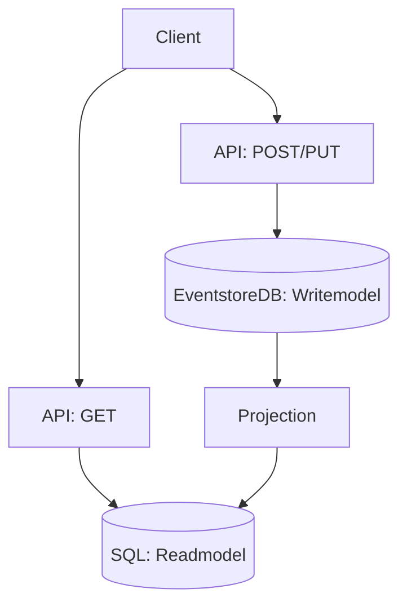

# Event Sourcing Workshop
If how you got there is just as important as the final state.

Event source pattern, is when you store the entire chain of data transformation, ant not just the final state. Each event is immutable, and describes a transformation between two states.

This workshop use [EventstoreDB](https://www.eventstore.com/eventstoredb) as event sourcing database.
Going through a sequence of tasks, we will try writing and reading events, and play with projection.

You will work on a simple API (Rest) module written in [Kotlin](https://kotlinlang.org/), with use of [Spring](https://spring.io/).
We will use one the official clients written in Java [Maven Central](https://central.sonatype.dev/artifact/com.eventstore/db-client-java/3.0.1/versions) / [Github](https://github.com/EventStore/EventStoreDB-Client-Java), when completing upcoming tasks. 
There is also other clients available, such as C#, Go, JavasScript, Rust and TypeScript. More details at [clients](https://developers.eventstore.com/clients/grpc/#connection-details)

For each task, there will be a set of tests that will verify your code. 

## Prerequisites
You need to bring your own PC, with your favorite OS. 
We will write Kotlin kode, so Java is required at version 17 or grater.
[Maven](https://maven.apache.org/) is used as build tool, and at the end we will use Docker and [Docker Compose](https://docs.docker.com/compose/) to get our hands dirty with EventstoreDB GUI. 

Important! As for the workshop, you will get access to a Wifi Network. It might not be as fast as you would like. Download this repo in advanced, build this project, and start docker. This will download all required dependencies, in advanced.
```cmd
## checkout repo
git clone git@github.com:visito/eventstore-wrokshop.git
cd eventstore-workshop

## Build project with maven
mvn clean install

## Start docker. This will download required images
docker compose up -d
## Shutdown resources, and relax. We have you coverd for workshop
docker compose down
```

### Task 1; write events
Start by check out branch *task_1*

In this workshop we will work with a bank account model. We will write three different event types:
- Created
- Deposit
- Withdrawal

You find these events in package: org.demo.eventstoredb.eventstore.events

Inside AccountRepo, you find three functions that need to be updated with help from you.
```kotlin
fun createAccount(accountID: String, name: String): WriteResult {
    //TODO Create AccountCreated event, and use eventstore Client to write event to EvenstoreDB
}

fun deposit(accountId: String, description: String, amount: Long): WriteResult {
    //TODO Create Deposit event, and use eventstore Client to write event to EvenstoreDB
}

fun withdrawal(accountId: String, description: String, amount: Long) {
    //TODO Create Withdrawl event, and use eventstore Client to write event to EvenstoreDB
}
```

Run tests to verify implementation:
```shell
mvn test -Dkotest.tags=task1
```

### Task 2; version control
In this task we will enforce two rules when writing events:
- Account stream should always start with a AccountCreated event.
- AccountCreated should only be written if stream does not exist.

Update your implemententaion in Task 1, or checkout branch *task_2*

Tip:
```java
public CompletableFuture<WriteResult> appendToStream(String streamName, AppendToStreamOptions options, EventData... events)
```

Run tests to verify implementation:
```shell
mvn test -Dkotest.tags=task2
```

### Task 3; Time to read
Great! It's time to get something back from our event driven database.
Help us implement 

Continue from where you finished on task 2, or start with branch *task_3*

```kotlin
private fun readEventsFromStream(streamName: String): ReadResult {
    //TODO read all events from stream with name $streamName
}
```

Run tests to verify implementation:
```shell
mvn test -Dkotest.tags=task3
```

## Event Sourcing and CQRS
Command-Query Segregation is a principal, where you seperate wrtire model from read model. This has two main advantages:
- Both write and read model can be optimized
- Scalability: By dividing our application in one query module, and one write module, we can scale them differently as needed.

We can implement CQRS principal, by project data from EventstoreDB to desired read model. As an example, a read model can be written in memory, SQL database, or NoSQL.



### Task 4; Project into memory
In this task you will implement a projection which will project all our data into an in memory read model.

Continue from where you finished on task 2, or start with branch *task_4*

Open AccountProjection and implement 
```kotlin
override fun onEvent(subscription: Subscription, resolvedEvent: ResolvedEvent)
```

This demo keeps our read model database is in memory, implemented as a map. Each Event should create or update the state in *accounts* 

Run tests to verify implementation:
```shell
mvn test -Dkotest.tags=task4
```

### Task 5; Play with EvenstoreDB GUI
Now you have worked with read, write and project operation. We are no going to start a local instance of EvenstoreDB, with our implemented RestAPI. 
AccountsController is annotated with [Swagger](https://swagger.io/) and build the project will generate a OpenAPI spec we will use to integrate with the API.

Bild (run mvn):
```shell
mvn clean install
```

Run (start docker compose):
```shell
docker compose up -d
```

Open EvenstoreDB [GUI](http://localhost:2113/web/index.html#/dashboard)
Open [OpenApi documentation](http://localhost:8080/swagger-ui/index.html#/)

Use *Try it out* and create a Account. Go to EvenstoreDB GUI and navigate to *Stream Browser*. You should now see your account listed under *Recently Created Streams*.
Open your newly created stream. Only one event will show. 

Go back to OpenApi documentation and use *Try it out* and do deposit and withdrawal. Se how events are added to your entity stream.

Keep your docker images running when moving on to last task...

### Task 6;
EventStoreDB ships with five built in projections.
- By Category ($by_category)
- By Event Type ($by_event_type)
- By Correlation ID ($by_correlation_id)
- Stream by Category ($stream_by_category)
- Streams ($streams)
Read more about [system projections](https://developers.eventstore.com/server/v20.10/projections.html#system-projections)

We can also create custom projections in JavaScript. We will create a new projection, that counts the number of deposits made on all accounts in total.
Open local instance of EvenstoreDB in your browser. Go to Projections. Select *New Projection*. Give your projection a name. 
Source should be:
```javascript
fromStream('$et-Deposit')
    .when({
        $init: function () {
            return {
                count: 0
            }
        },
        Deposit: function (state, event) {
            state.count += 1;
        }
    })
    .transformBy(function (state) {
        return {Total: state.count}
    })
    .outputState()
```
Change Mode from *One-time* to *Continues*
Hit *Create*

Congratulations! You have now created your first custom projection. Count should now be 1. Try go back to OpenApi specification and add another deposit and see if your projection count increase?


